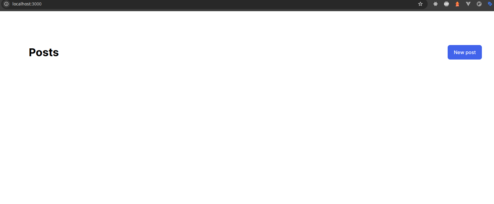

## Initial Setup
After a long time since I first read it, recently I read once again the official guide about [Caching with Rails](https://guides.rubyonrails.org/caching_with_rails.html) and that sparked some curiosity in me to discover a bit more closely what Rails has to offer.

To research this topic, I'll start by creating a new rails project from Rails 8 with all default configuration except Tailwind for the sake of simplicity. This means, I'll be using Solid Cache, Solid Queue and Solid Cable for this article, all of which use SQLite. So, let's get on it.

Let's run the commands to create the new Rails app, and a basic model to have something going.
```bash
 rails --version
Rails 8.0.0

rails new caching --css=tailwind
cd caching
rails g scaffold Post title
rails db:migrate
```

And let's uncomment the last line in our routes:

```ruby
# config/routes.rb
root "posts#index"
```

Now we can start the server and open the browser on http://localhost:3000 to see our site:
```bash
bin/dev
```



[Commit 1](https://github.com/divagueame/caching/commit/b12c6fd49e64378e19c093ab2506b95bffbc0e8d)

---
## The most Basic deployment with Kamal

I have my pet project at https://www.facturita.online, so I'll deploy this app on a subdomain using Kamal. I use Cloudflare to manage my DNS, so I created a A Record pointing to my server. 
I added a .env file to the root of my project. You will need a account on Docker hub and to create a token which Kamal will use to push the image to their registry. The Rails Master key comes from 'config/master.key'. These values should be kept secret and never shared/commited to your repository.

```
KAMAL_REGISTRY_PASSWORD=dckr_pat_i89mp94MQjMa0KxQW2cmAOvplq8
RAILS_MASTER_KEY=094n921lp9a2ec88341mb514ae49d983
```
and then we can adjust the deploy file Kamal will use to deploy our app:


```
service: caching
image: martinarceteixeira/caching
servers:
  web:
    - caching.facturita.online
proxy: 
  ssl: true
  host: caching.facturita.online
registry:
  username: martinarceteixeira
  password:
    - KAMAL_REGISTRY_PASSWORD
builder:
  arch: amd64
env:
  secret:
    - RAILS_MASTER_KEY
```

This is the most basic configuration to get our site live. You can run this command now to setup our site:
```
kamal setup

```

After some minutes, you should be able to visit it at your url, in this case at [https://caching.facturita.online/](https://caching.facturita.online/)

[Commit 2]()

