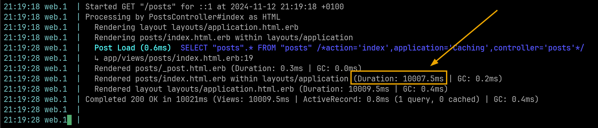

## Initial Setup
After a long time since I first read it, recently I read once again the official guide about [Caching with Rails](https://guides.rubyonrails.org/caching_with_rails.html) and that sparked some curiosity in me to discover a bit more closely what Rails has to offer.

To research this topic, I'll start by creating a new rails project from Rails 8 with all default configuration except Tailwind for the sake of simplicity. This means, I'll be using Solid Cache, Solid Queue and Solid Cable for this article, all of which use SQLite. So, let's get on it.

Let's run the commands to create the new Rails app, and a basic model to have something going.
```bash
 rails --version
Rails 8.0.0

rails new caching --css=tailwind
cd caching
rails g scaffold Post title
rails db:migrate
```

And let's uncomment the last line in our routes:

```ruby
# config/routes.rb
root "posts#index"
```

Now we can start the server and open the browser on http://localhost:3000 to see our site:
```bash
bin/dev
```


[Commit 1 - Setup](https://github.com/divagueame/caching/commit/b12c6fd49e64378e19c093ab2506b95bffbc0e8d)

---

## The most Basic deployment with Kamal

I have my pet project at https://www.facturita.online, so I'll deploy this app on a subdomain using Kamal. I use Cloudflare to manage my DNS, so I created a A Record pointing to my server. 
I added a .env file to the root of my project. You will need a account on Docker hub and to create a token which Kamal will use to push the image to their registry. The Rails Master key comes from 'config/master.key'. These values should be kept secret and never shared/commited to your repository.

```
KAMAL_REGISTRY_PASSWORD=dckr_pat_i89mp94MQjMa0KxQW2cmAOvplq8
RAILS_MASTER_KEY=094n921lp9a2ec88341mb514ae49d983
```
and then we can adjust the deploy file Kamal will use to deploy our app:

```
service: caching
image: martinarceteixeira/caching
servers:
  web:
    - caching.facturita.online
proxy: 
  ssl: true
  host: caching.facturita.online
registry:
  username: martinarceteixeira
  password:
    - KAMAL_REGISTRY_PASSWORD
builder:
  arch: amd64
env:
  secret:
    - RAILS_MASTER_KEY
```

This is the most basic configuration to get our site live. You can run this command now to setup our site:
```
kamal setup
```

After some minutes, the site is live at: [https://caching.facturita.online/](https://caching.facturita.online/)

[Commit 2 - Setup Kamal](https://github.com/divagueame/caching/commit/0ba240b2928760f26244c5f8968b44bbc1d0ac33)

---

## Config Solid Cache in Development

Rails 8 ships with Solid Cache by default, however it's not enabled on development. So we'll need to make a couple of changes to see our progress on our machine.

Start by running this command to enable Action Controller caching:
```
rails dev:cache 
Action Controller caching enabled for development mode.
```

We'll need to configure the cache store to use solid_cache_store instead of default in memory cache:
```
# config/environments/development.rb
#  config.cache_store = :memory_store # Comment out this line
config.cache_store = :solid_cache_store
```

[Commit 3 - Config solid_cache in development](https://github.com/divagueame/caching/commit/dc6164bb4fd8fcec19107bf51bd3beed8eef87fa)

---

## Our very first cache - Fragment Caching

You should definitely have a look at the official Rails guide about [fragment caching](https://guides.rubyonrails.org/caching_with_rails.html#fragment-caching).

Let's say in your template, you have a template that takes a while to compute, like for example this totally natural piece of code:
```ruby
<% 10.times do %>
    <%  sleep 1 %>
    <h1>My beautiful post</h1>
<% end %>
```

We can inspect the logs and assert that this is taking around 10 seconds. We could improve that by caching.


Just by wrapping our code in a call to cache, we can speed up all following requests by serving that piece/fragment from our cache instead of computing it on the fly once again:

```ruby
<% cache do %>
  <% 10.times do %>
    <%  sleep 1 %>
    <h1>My beautiful post</h1>
  <% end %>
<% end %>
```

If we have another look at the server logs, we can see what will happen:


1. When the action is triggered, the controller will request the generated hash for that fragment to the cache, in our case, Solid cache. 
2. Since it could not find anything, it will write it. So next time this is requested, it will be available.
3. The first request will be processed as usual, in our case it's 10000ms.
4. However, when the next request comes in, the cache is hit and directly served without recomputing the template.
5. So, it will only take 4ms to get that fragment.

Alright, this is the most basic example in a non real scenario, but it's enough to get the point across. You can generate pieces of your template once and keep them until they're needed for another request.


