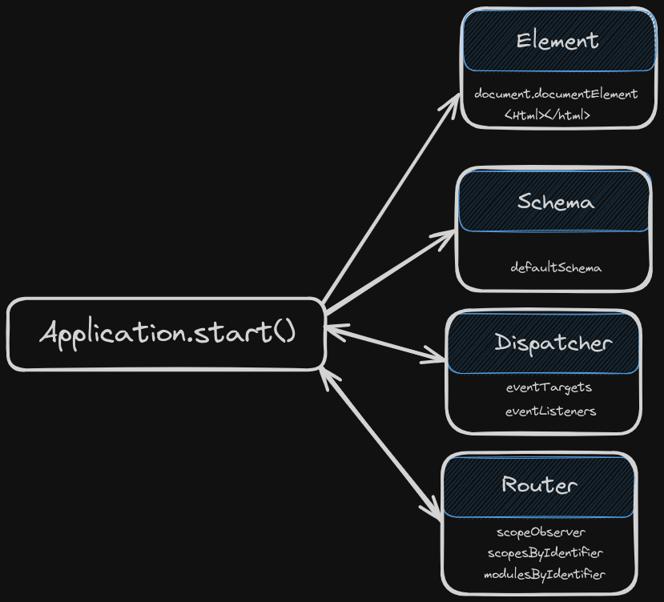

This article assumes the reader has some knowledge of the Hotwire Ecosystem and in particular with Stimulus JS. This is not an itroduction, not a guide on how to use it, but rather a step by step unboxing of the library for those who might be interested in knowing what this library does and how it's built. My goal is not to introduce Stimulus to you. It would not be possible for me to do it better than the [official docs](https://stimulus.hotwired.dev/).

To begin with, let's go through the process of initializing the library. We'll assume we don't have any controllers
attributes in our html, nor we have yet registered any Stimulus controllers.
Let's say, we import Stimulus. Then as per docs, we initialize like this:

```javascript
import { Application } from "@hotwired/stimulus";
import "@hotwired/turbo";

const application = Application.start();
```

What's really happening? We imported the [Application](https://github.com/hotwired/stimulus/blob/main/src/core/application.ts)
class and called the method `start()` on the class itself and that's it. We have not yet interacted with it whatsoever. From this moment, we are ready to register the controllers manually like `Stimulus.register("hello", HelloController)`, but we are not going to do that yet. Let's have a look first at the source of `start()`:

```
export class Application implements ErrorHandler { //
  ...
  static start(element?: Element, schema?: Schema): Application { // (1)
    const application = new this(element, schema) // (2)
    application.start() // (3)
    return application
  }
```

**(1)** The keyword `static` just before a method, declares it as a Class method, not an instance method,
therefore we can call `Application.start()`. This method takes two optional arguments (element and schema),
**element** will be the <html> document itself and **schema** is where the keywords are defined, like for example
`data-controller` or `data-action`. In this case, we did not pass any parameters, so they will be
undefined in this case and will take the default values, but we will get there in a minute.
**(2)** The first line will trigger the constructor of Application class, so then we'll have an instance
of it stored in `application`.

Let's have a look then at the constructor that was just used to create our Application instance.

```
  constructor(element: Element = document.documentElement, schema: Schema = defaultSchema) {
    ...
    this.element = element
    this.schema = schema
    this.dispatcher = new Dispatcher(this)
    this.router = new Router(this)
    this.actionDescriptorFilters = { ...defaultActionDescriptorFilters }
  }
```

Interesting! Since the values for element and schema were undefined(remember we did `Application.start()`), they took the default values which are defined in
the constructor. Not too surprising when you think about it, we'll use the whole HTML document to be root element
of our application instance and we'll use the default schema. I have a clue of what the schema might be but
let's have a quick look to get a general idea of what is happening. The default schema looks like this:

```
export const defaultSchema: Schema = {
  controllerAttribute: "data-controller",
  actionAttribute: "data-action",
  targetAttribute: "data-target",
  targetAttributeForScope: (identifier) => `data-${identifier}-target`,
  outletAttributeForScope: (identifier, outlet) => `data-${identifier}-${outlet}-outlet`,
  keyMappings: {
...
}
```

By looking at it we can see identify the keywords that Stimulus will use to scan our document and keep track of the events
and trigger the expected behaviour. So, we have 'controllers', 'actions', 'targets' and 'outlets'.

Mmmm... alright, let's keep rolling with what's happening in the constructor. It's creating two instances
of Dispatcher and Router, to each one of them, it's passing the current application instance as an argument. This
will make the application instance available in the dispatcher and the router. So we can see some initial relations
being created.

```
    this.dispatcher = new Dispatcher(this)
    this.router = new Router(this)
```

In the dispacher's constructor there is not much really happening. An initial Map of EventListener is initialized and the state of `start` is set to false. We can guess, like the Application instance, it will be reused across the entire library.

```
export class Dispatcher implements BindingObserverDelegate {
  readonly application: Application
  private eventListenerMaps: Map<EventTarget, Map<string, EventListener>>
  private started: boolean

  constructor(application: Application) {
    this.application = application
    this.eventListenerMaps = new Map()
    this.started = false
  }
...
```

Let's peep into the Router's constructor.

```
export class Router implements ScopeObserverDelegate {
  readonly application: Application
  private scopeObserver: ScopeObserver
  private scopesByIdentifier: Multimap<string, Scope>
  private modulesByIdentifier: Map<string, Module>

  constructor(application: Application) {
    this.application = application
    this.scopeObserver = new ScopeObserver(this.element, this.schema, this)
    this.scopesByIdentifier = new Multimap()
    this.modulesByIdentifier = new Map()
  }
...
```

Similarly to the **dispatcher**, the **router** also can read the application. Furthermore, it also creates an instance of `ScopeObserver`, we'll dive into it later, but for now, let's keep exploring here. We can see there are **scopes** and **modules** but that's not very enlightening since we don't know yet what those terms really refer to, as they could have different meanings. I know Stimulus is using MutationObserver to track changes in the DOM and then dispatch the corresponding events when it's due, but for now, let's try to get the whole picture together.


